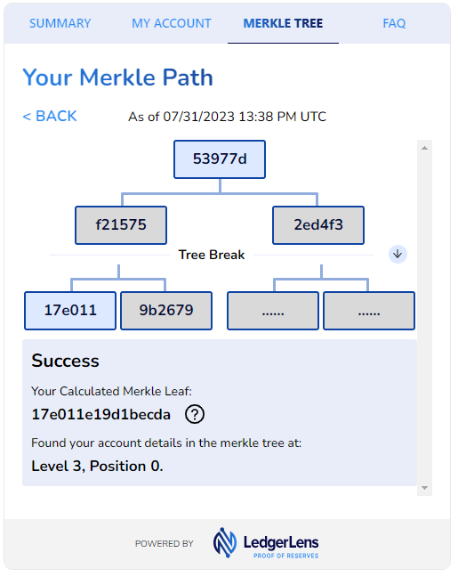
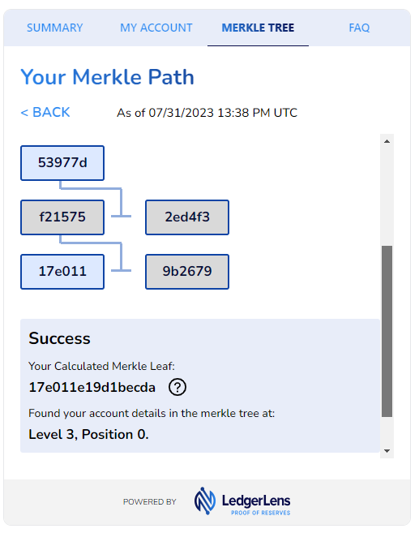

# Proof-of-Reserves Merkle Tree Generator and Verifier (by The Network Firm)

This ReadMe introduces the background and technical details supporting the Merkle Tree Generator and Verifier tools
utilized
in The Network Firm’s Proof-of-Reserves engagement process. Additionally, these tools have been integrated into TNF's
Auditor & Attestation Toolkit, LedgerLens: Pro (https://www.thenetworkfirm.com/pro), which is available for 3rd-party
accounting firms, CPA's, and chartered accountants for use in their own attestation engagements.

Many customized versions of Merkle Tree Generators and Verifiers exist. Currently, this repository is specific to a
Merkle Tree Generator and Verifier that ingests a CSV or TXT file (often referred to as a "Customer Liability Extract"
or "CLE") with a listing of user identifiers and _n_ number of customer liability balances ("User Record") per row. The
column headers in the CLE file are the liabilities (i.e. digital assets) in scope for the Proof of Reserves.

From the CLE, this tool will generate a full Merkle Tree and Merkle Root Hash, effectively "sealing" the dataset from
further tampering.

**CLE Header Syntax**

The column headers in the CLE adhere to the following syntax:

```
User Identifier, Liability #1, Liability #2, ...., Liability #N
```

An example of column headers within a production CLE:

```
PoR Record ID, BTC, ETH, Staked ETH, ...., XRP
```


**User Records Syntax**

The relevant format for each User Record within the CLE adheres to the following syntax:

```
User Identifier, Acct. Bal #1, Acct. Bal #2, ...., Acct. Bal #N
```

An example of how an individual user’s platform account data manifests within the Customer Liability Extract:

```
483759v3, 0.04, 5.123, 4.25, 1.000005
```

## Background

The Network Firm’s Proof-of-Reserves process employs a Merkle Tree approach to give users the ability to independently
verify
their individual funds were included within the total Customer Liabilities figure as calculated within a
Proof-of-Reserves engagement.

## Process Overview

1) ### Attestation Provider observes the generation of the Customer Liability Extract.

   The Attestation Provider ("AP") observes the generation of the Customer Liability by the digital asset platform and
   observes the report’s
   delivery to the attestation provider. The AP may perform additional procedures to validate the inputs and outputs to
   the customer liability extract are complete and accurate.

   [Simple CLE Demo Dataset.csv](source/Simple%20CLE%20Demo%20Dataset.csv)

2) ### Attestation Provider generates the Merkle Tree by importing the CLE into the Merkle Tree Generator

   The AP will then import the user balances into the Merkle Tree Generator to generate the Merkle Tree. Optionally, the
   digital asset platform under attestation may also want to generate the Merkle Tree to effective "check the AP's work."

   ```shell
   docker build -t por-merkle-tree-toolset .
   docker run --rm -it -v "$(pwd)/source":/app/source -v "$(pwd)/artifacts":/app/artifacts por-merkle-tree-toolset bin/aggregator.js bin/aggregator.js --input 'source/Simple CLE Demo Dataset.csv' --output artifacts/aggregator_output.csv --balanceTo 16  --balanceEntrySeed 5f762343266da862769a15de653747816fe06032c2e90a14da06f7a7caa6da7a --sortBalancedEntries --hashingStrategy nextgen
   docker run --rm -it -v "$(pwd)/artifacts":/app/artifacts por-merkle-tree-toolset node --max_old_space_size=12288 bin/merkalizer.js --input artifacts/aggregator_output.csv --output artifacts/extracted_tree.csv```

3) ### Attestation Provider verifies the total user balance and publishes the Merkle Tree and the Merkle Root Hash

   After the Merkle Tree is successfully generated, the Merkle Root Hash, the total User Count, and the Total Asset
   amounts will be calculated and written to separate files within the tool directory for the AP to verify.

4) ### Users independently verify their account balance
   After importing the plain text file generated from the Merkle Tree Generator into the Merkle Tree Verifier, users
   will input their Hashed User ID and/or asset balance(s) to trigger the verification process. If the
   Hashed User ID and the liability balance(s) match the record in the Merkle Tree, a successful result will be
   displayed with the node location of the user information within the Merkle Tree. The Merkle Tree Root Hash will also be
   re-calculated using the imported file for users to verify the Root Hash.

   <p align="center">
    
   </p>

   Note: to enable external user's to verify inclusion, the AP or exchange may need to may this repo available _or_
   enable verification via a custom-built user interface or leveraging a LedgerLens Widget (example
   here: https://widget.pro.ledgerlens.io/demo).

## Additional Context regarding Merkle Trees

### What is Merkle Tree?

A Merkle Tree is a cryptographic tool that enables the consolidation of large amounts of data into a single hash. This
single hash, called a Merkle Root, acts as a cryptographic seal that “summarizes” all the inputted data. Additionally,
Merkle Trees give users the ability verify to specific contents were included within a particular set of “sealed” data.
the Network Firm leverages these properties of Merkle Trees for use in Proof of Reserve Engagements and associated
tooling to verify user accounts are included within the Customer Liability Extract generated by a digital asset platform
and inspected by the
AP.

Merkle Trees are used by Bitcoin, Ethereum, and many other blockchain protocols to “fingerprint” or provide a single
unique hash for all transactions included within a particular block. The Network Firm uses a very similar strategy
during our
Proof of Reserves to create a single unique hash for all user accounts and associated balances within a platform’s
trading database, the Merkle Root.

### Building the Merkle Tree with Hashed User IDs and User Balances

The Merkelization process begins by segregating each individual data point within the data set. For a Proof of Reserves
engagement, each individual data point is a unique hashed user ID and the user’s platform balances as tracked with in a
platform’s database. Independent attestation providers, such as The Network Firm, only see the customer’s hashed user
ID, and never any
personally identifiable information. The user’s hashed user ID and platform account balances are then hashed one more
time using SHA256 to create a unique and private hash value, which acts as a personal Merkle Leaf for each user.

   <p align="center">
    
   </p>

We can then use a similar approach as used in Bitcoin and other blockchains to consolidate all of the Merkle Leaves for
each user into a single hash, known as the Merkle Root.

To create the Merkle Root, one user’s Merkle Leaf is paired up with another user’s Merkle leaf (a “Sibling” Leaf) and
hashed together, creating a new, unique hash that summarizes the 2 user’s data within a single Merkle Branch. This
process is repeated until all user’s Merkle Leaves are consolidated into the single Merkle Root. The Merkle Root
represents a hash that includes all hashed user IDs and account balances from the platform’s database. Because hash
functions are “one-way streets,’ a single individual who knows the Root Hash cannot travel backward through the tree to
unseal information about leaves or branches. A user that knows the raw or original inputs for a single Merkle Leaf, can
validate that those unique inputs were in fact used/included in the Merkelization process.

  <p align="center">
    
  </p>

The process began with individual and sibling Merkle Leaves (hashed User ID + account balances), which flow through the
Merkle
Branches (intermediate hashes) to a Merkle Root (consolidated hash of all data), thus completing a full Merkle Tree!

  <p align="center">
    
  </p>

### Verifying the Hashed User ID and Balances using a Merkle Proof

Since the Merkle Root is related to every individual Merkle Leaf, a user can recalculate their individual path to the
Root to ensure their user details were included within a Proof of Reserves. To perform this task, a user needs their
personal Merkle Leaf hash and every Sibling Leaf hash used along its path the Merkle Root. This is known as a user’s
Merkle Path.

  <p align="center">
    
  </p>

LedgerLens’ Merkle Tree Visualizer currently includes the Sibling Leaves in a user’s Merkle Path en route to the Merkle
Root. A user could recalculate their full path to the Merkle Root using the information provider. Currently, the Merkle
Tree Visualizer is only accessible by building a custom user interface or leveraging a LedgerLens Widget (example
here: https://widget.pro.ledgerlens.io/demo).


  <p align="center">
    
  </p>

## How to install

1. Clone repository
2. Confirm docker is installed
3. Build docker image `docker build -t por-merkle-tree-toolset .`

## How to run

### Aggregator

This tool converts the Customer Liability Extract file received from the client into a form that is suitable for a Proof of Reserves engagement. It
can optionally "balance" or "pad" the source file with the number of additional entries to create a "symmetrical" Merkle Tree (which has a number of records = 2^x).
The "padded" records can be added to the "end" or be spread across the source file. Processing also implies that for each entry there will be a hash
of the entire entry that later will be used for merkalization purposes.

```shell
$ bin/aggregator.js -h
Usage: aggregator [options]

Options:
  --input <value>             Input filename (default: "input.csv")
  --output <value>            Output filename (default: "output.csv")
  --hashingStrategy <value>   Hashing strategy (choices: "legacy", "nextgen")
  --balanceBy <number>        Number of additional records to balance the tree (default: 0)
  --balanceTo <number>        Expected number of records in the target file. Mutually exclusive with --balanceBy
  --targetLevels <number>     Expected number of levels on the resulting tree. Mutually exclusive with --balanceTo and --balanceBy options
  --balanceEntrySeed [value]  Static value to use as a prt of userId in additional entries. Required if additinal entries must be added to balance the tree
  --sortBalancedEntries       Only applicable if additinal entries should be added
  --suppressProgress          Do not output progress (default: false)
  -h, --help                  display help for command
```

#### Example of invocation

```shell
docker run --rm -it -v "$(pwd)/source":/app/source -v "$(pwd)/artifacts":/app/artifacts por-merkle-tree-toolset bin/aggregator.js bin/aggregator.js --input 'source/Simple CLE Demo Dataset.csv' --output artifacts/aggregator_output.csv --balanceTo 16  --balanceEntrySeed 5f762343266da862769a15de653747816fe06032c2e90a14da06f7a7caa6da7a --sortBalancedEntries --hashingStrategy nextgen
```

### Merkalization Tool

The Merkalization tool builds a Merkle Tree from the from the output of the aggregator tool and extracts Merkle path (Merkle "Branches") and proof ("Sibling Leaves") for
every user record that exists in the source file. This tool also outputs root hash of the tree (Merkle Root), number of leaves and number of
tree layers into the corresponding files within `artifacts` directory. The Merkalizer tool requires a large amount of memory
due to the merkle tree structure. Therefore you might need to adjust `max_old_space_size` node option to fit merkle tree
into memory.

#### Options

```shell
bin/merkalizer.js -h 
Usage: merkalizer [options]

Options:
  --input <value>               Input filename (default: "input.csv")
  --output <value>              Output filename (default: "output.csv")
  --datasetFormat <number>      Export format version (choices: 1, 2, default: 2)
  --treeRootFileName <value>    Tree root filename (default: "artifacts/tree_root.txt")
  --treeLeavesFileName <value>  Tree leaves filename (default: "artifacts/total_tree_leaves.txt")
  --treeLayersFileName <value>  Tree levels filename (default: "artifacts/total_tree_layers.txt")
  --suppressProgress            Do not output progress (default: false)
  -h, --help                    display help for command
```

#### Example of invocation

```shell
docker run --rm -it -v "$(pwd)/artifacts":/app/artifacts por-merkle-tree-toolset node --max_old_space_size=12288 bin/merkalizer.js --input artifacts/aggregator_output.csv --output artifacts/extracted_tree.csv  
```
